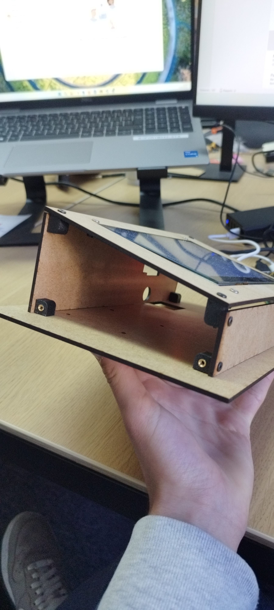
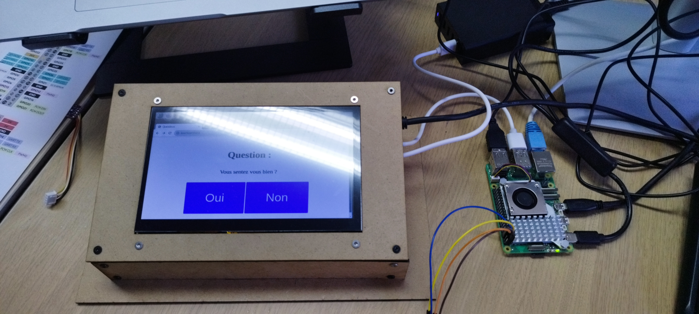
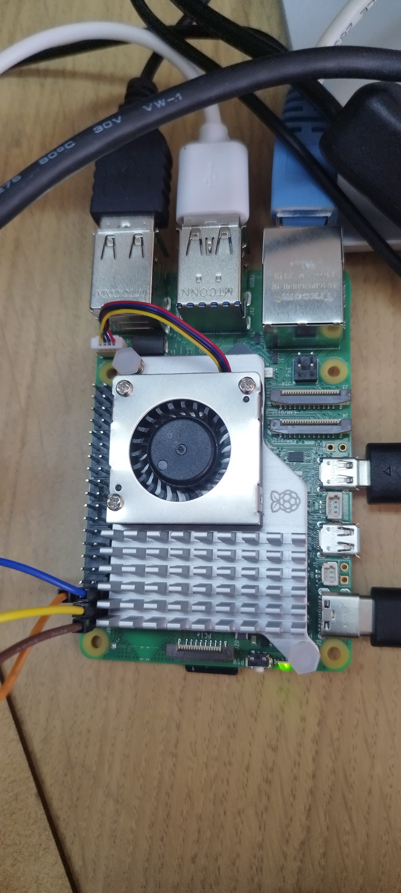

# ModuleAir_Pi

ModuleAir-Pi est un projet porté par AirCarto : https://aircarto.fr/

# Explications

Le ModuleAir_Pi est un dispositif qui a vocation à déterminer l'impact de la qualité de l'air sur le ressenti, l'humeur, le bien-être etc
Pour se faire, le ModuleAir_PI propose une à plusieurs question fermés auxquels l'utilisateur doit répondre. Suite à cela, l'utilisateur est dirigé sur une page où des données tel que la temperature, le taux de CO2, le taux d'humidité ou encore le nombre de PM sont affichées. 

## Hardware

- Un raspberry PI 5 se charge de lancer les programmes, de receuillir les données, de faire le lien entre les capteurs et l'écran, d'afficher les questions etc
- Les questions et les données sont affichés sur un écran tactile de 7 pouces de résolution 1024x600 
- La temperature, l'humidité et la pression sont mesurés par une sonde BME280. Cette dernière est branchée au Raspberry sur les ports 3v-GND-SDA-SCL. La marge de précision des données est de 1°C. Les sondes BME sont au nombre de 3. Afin de gagner en précision, le ModuleAir_Pi calcule la moyenne de temperature, de pression et d'humidité remontées par les 3 BME. Cela permet également de prévenir d'une eventuelle anomalie. Si une sonde est défailante, la comparaison avec les 2 autres permet de la trouver.  
- Les PM sont mesurés par un capteur NextPM, connecté sur un port USB avec un convertisseur CH340. 
- Le tout est disposé dans un boîtier (c.f partie Boitier)

## Software

Différents modules sont nécessaires au fonctionnement du ModuleAire_Pi : 
- Apache2 pour le serveur web.
- PHP pour le front-end (développement des pages de questions et de données). 
- Python pour le back-end (développement des scripts d'instructions d'écriture et de lecture de données).
- InfluxDB pour stocker les données recensées par les différents capteurs et sondes. 
- Docker pour le fonctionnement d'InfluxDB.
- Postgres pour stocker les réponses saisies par l'utilisateur (bien-être + données de temperature, pression etc au moment de sa réponse).

Ces differents modules peuvent être installés avec les commandes suivantes : 
- Apache2 : sudo apt install apache2
- PHP : sudo apt install php
- Serial : pip install pyserial
- Pip : sudo apt install python3-pip
- Python : sudo apt install python3
- InfluxDB : sudo curl -sL https://repos.influxdata.com/influxdb.key | sudo apt-key add - | pip install influxdb-client
- Docker : https://docs.docker.com/engine/install/raspberry-pi-os/
- Postgres : sudo apt install postgresql postgresql-contrib
- Psycopg2 : pip install psycopg2-binary

## Fichier

- bme280.py : Permet le fonctionnement de la sonde BME280 et récolte les données de temperature, pression et humidité.
- Write_data_***.py : Inscrit les données recupérés par les différents capteurs et sondes sur InfluxDB.
- Read_data_***.py : Récupère les données depuis InfluxDB.
- global.php : Donne l'identifiant du capteur (à modifier pour chaque boîtier utilisé). Le nom est repercuté dans "device_id.txt"
- reponse.php | index.html | questionX.html | style.css : affichent respectivement les pages web de questions et de données

Remarque : Le fichier crontab (accessible via la commande crontab -e) doit être modifier de la sorte afin d'automatiser les processus : 
*/2 * * * * python /var/www/html/ModuleAir_Pi/Write_data_BME280.py 
*/2 * * * * python /var/www/html/ModuleAir_Pi/Write_data_NextPM.py
" * * * * * php /var/www/html/ModuleAir_Pi/global.php
*/2 * * * * python /var/www/html/ModuleAir_Pi/Write_temp_core.py
@reboot /home/airlab_test/Desktop/app.sh

## Boitier

<<<<<<< HEAD
=======

>>>>>>> d27e177 (maj)

## TODO

- Installation de la sonde CO2
- Réflexion autour du design final du boitier 
- Brancher le ModuleAir avec une alimentation 5 Volt - 8 ampères pour répondre aux besoin du boîtier étant gourmand en énérgie
